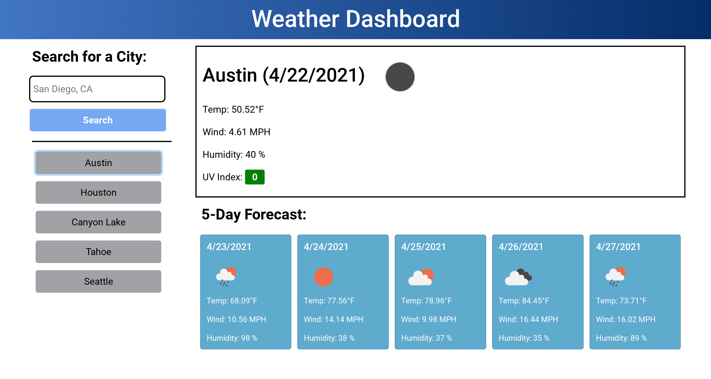

# Portfolio

## Description
An application that showcases my projects and abilities as a full stack web developer

## Made With
* HTML
* CSS
* JavaScript
* Node

## Packages
* React

## Website
http://akman47.github.io/portfolio-react

## Snapshot

## Portfolio Applications
* [Clonello](https://powerful-falls-76508.herokuapp.com/)

* [Tech Blog](https://protected-oasis-13537.herokuapp.com/)

* [Weather Dashboard](https://akman47.github.io/weather-dashboard)

* [Coding Quiz](https://akman47.github.io/code-quiz)

* [Happy Meals](https://jmol721.github.io/get-you-a-happy-meal-toy-not-included)

## Credit
Angela Man 
[GitHub](https://github.com/akman47)